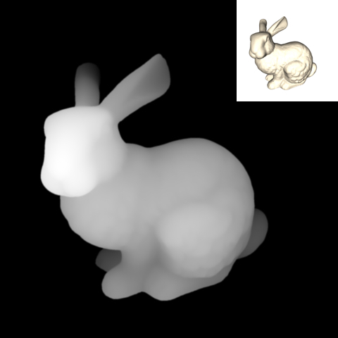
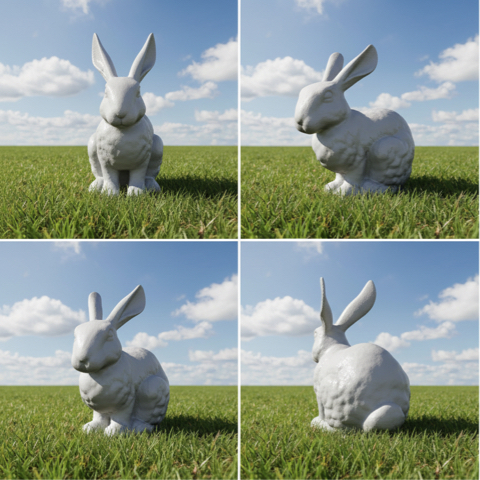
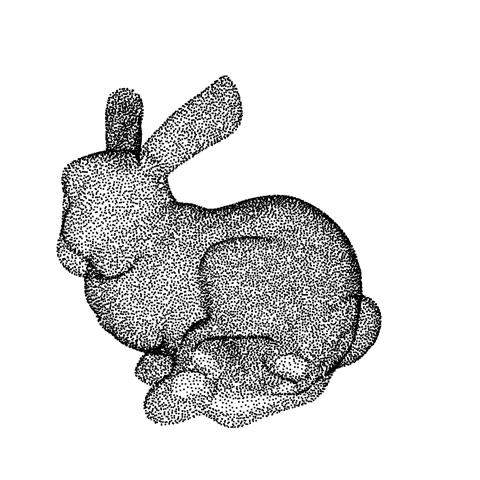
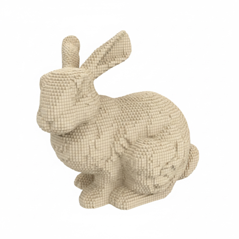
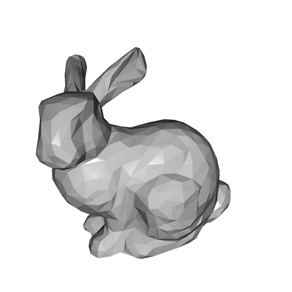
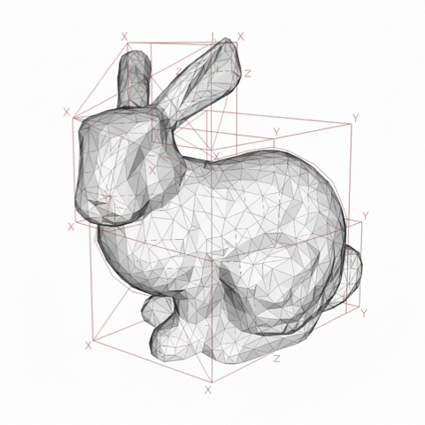
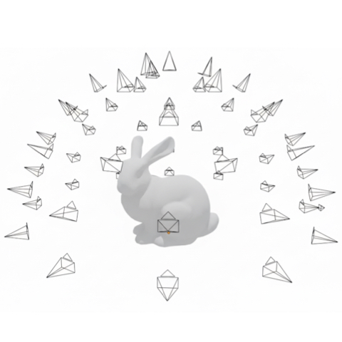
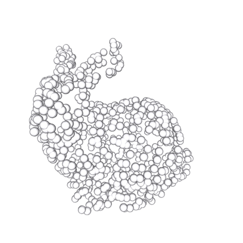
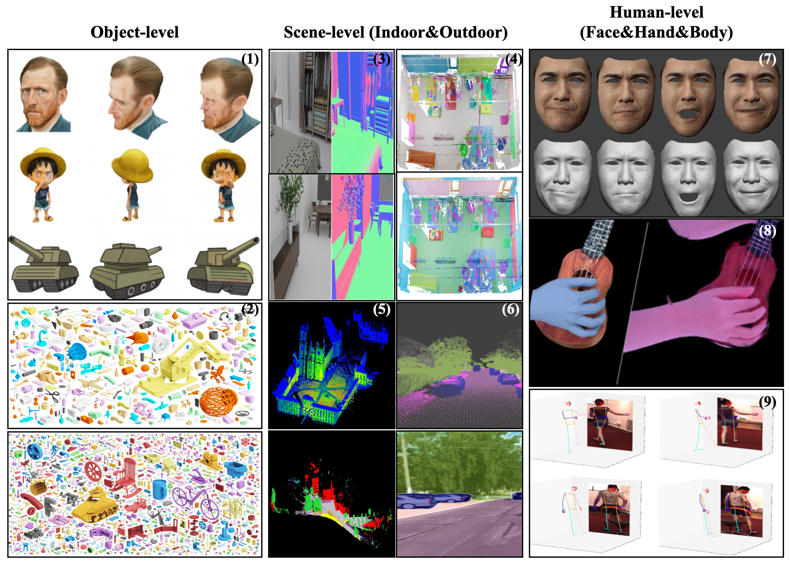

<div align="center">

# A Cookbook of 3D Vision: Data, Learning Paradigms, and Application

<p>
  <a href="#"></a>
  <a href="https://arxiv.org/"></a>
  <a href="#-citation"></a>
  <a href="https://github.com/Hongyang-Du/awesome-3d-datasets"></a>
  <a href="#-contributing"></a>
</p>

<p>
  <em>A continuously-updated, data-centric map of 3D vision — bridging
  <strong>representations</strong>, <strong>learning paradigms</strong>, and
  <strong>applications</strong> in one coherent framework.</em>
</p>

<p>Last updated: <!--LAST_UPDATED--> 2026-05-07

<table>
  <tr>
    <td align="center" width="25%"><br><sub><b>RGB-D</b></sub></td>
    <td align="center" width="25%"><br><sub><b>Multi-view Images</b></sub></td>
    <td align="center" width="25%"><br><sub><b>Point Cloud</b></sub></td>
    <td align="center" width="25%"><br><sub><b>Voxels</b></sub></td>
  </tr>
  <tr>
    <td align="center" width="25%"><br><sub><b>Mesh</b></sub></td>
    <td align="center" width="25%"><br><sub><b>CAD</b></sub></td>
    <td align="center" width="25%"><br><sub><b>Implicit Field</b></sub></td>
    <td align="center" width="25%"><br><sub><b>3D Gaussians</b></sub></td>
  </tr>
</table>

<sub><em>Eight 3D representations of the Stanford bunny — the structural spectrum that this cookbook unifies.</em></sub>

</div>

> 🎉 **News (May 2026)** — Our paper *“A Cookbook of 3D Vision: Data, Learning Paradigms, and Application”* has been accepted to the **CVPR 2026 Workshop**! We are now actively maintaining this repository as the living companion to the paper. Pull requests, issues, and suggestions are very welcome.

## 🌟 Overview

- [A Cookbook of 3D Vision: Data, Learning Paradigms, and Application](#a-cookbook-of-3d-vision-data-learning-paradigms-and-application)
  - [🌟 Overview](#-overview)
  - [📝 Abstract](#-abstract)
  - [📄 Citation](#-citation)
  - [🧱 3D Representations](#-3d-representations)
  - [🧠 Learning Paradigms](#-learning-paradigms)
    - [🎨 Differentiable Rendering](#-differentiable-rendering)
    - [🛰️ End-to-End Geometric Foundation Models](#️-end-to-end-geometric-foundation-models)
    - [🌌 Generative Priors \& Native 3D Foundation Models](#-generative-priors--native-3d-foundation-models)
  - [⚒️ Applications](#️-applications)
    - [🔄 3D Reconstruction](#-3d-reconstruction)
    - [✨ 3D Generation](#-3d-generation)
    - [🎬 3D-Consistent Video Generation](#-3d-consistent-video-generation)
    - [🌐 4D Rendering \& World Models](#-4d-rendering--world-models)
    - [🤖 Spatial Intelligence in Vision-Language-Action](#-spatial-intelligence-in-vision-language-action)
  - [📚 3D Datasets Summary](#-3d-datasets-summary)
    - [📊 Dataset Statistics](#-dataset-statistics)
    - [👤 Human](#-human)
    - [🎯 Object](#-object)
    - [🏙️ Scene](#️-scene)
    - [📊 Modalities of 3D Datasets](#-modalities-of-3d-datasets)
  - [👥 Authors \& Contributors](#-authors--contributors)
  - [🤝 Contributing](#-contributing)

## 📝 Abstract

> 3D vision has rapidly evolved, driven by increasingly diverse data representations, learning paradigms, and modeling strategies. Yet the field remains fragmented across representations and benchmarks, making it difficult to develop unified perspectives on efficiency, fidelity, and scalability. This work provides a **data-centric taxonomy** of 3D vision that connects geometric representations, datasets, learning frameworks, and applications within a single conceptual map.
>
> We begin by analysing the principal structural representations of 3D data — *point clouds, meshes, voxels, and 3D Gaussians* — along with their acquisition pipelines. We then examine how dataset design, benchmark construction, and supervision regimes shape recent advances, spanning **2D-supervised 3D learning**, **implicit neural representations**, and **4D world modeling**. Through this integrative lens, we clarify the relationships among representations, learning paradigms, and downstream tasks in *reconstruction, generation, and video modeling*, offering a consolidated view of emerging trends toward balancing efficiency and fidelity, and toward multimodal geometric grounding.

## 📄 Citation

If you find this repository useful for your research, please consider citing:

```bibtex
@inproceedings{du2026cookbook,
  title     = {A Cookbook of 3D Vision: Data, Learning Paradigms, and Application},
  author    = {Du, Hongyang and Li, Zongxia and Liu, Dawei and Li, Runhao and
               Song, Haoyuan and Zhang, Qingyu and Wang, Yubo and Ni, Jingcheng and
               Gui, Shihang and Dong, Congchao and Hu, Tao},
  booktitle = {Proceedings of the IEEE/CVF Conference on Computer Vision and Pattern
               Recognition (CVPR) Workshops},
  year      = {2026}
}
```

## 🧱 3D Representations

3D vision relies on diverse data representations, each with distinct trade-offs in **structure**, **efficiency**, and **fidelity**. The table below summarizes the major formats we cover in the cookbook.

| Representation       | Structure                              | Efficiency | Fidelity   | Typical Applications                        |
| :------------------- | :------------------------------------- | :--------- | :--------- | :------------------------------------------ |
| RGB-D                | 2.5D grid (RGB + depth)                | High       | Medium     | SLAM, indoor mapping, pose estimation        |
| Multi-view Images    | 2D views + camera poses                | High       | High\*     | SfM, MVS, NeRF/3DGS input                   |
| Point Cloud          | Unstructured 3D points                 | High       | Low–Medium | Detection, mapping, robotics                 |
| Mesh                 | Vertex–edge–face graph                 | Medium     | High       | Modeling, animation, simulation              |
| Voxel Grid           | Dense 3D lattice                       | Low        | Medium     | Volumetric CNN, segmentation                 |
| Implicit Field       | Neural function $f(\mathbf{x})$        | Low        | Very High  | View synthesis, scene modeling               |
| 3D Gaussians         | Sparse 3D Gaussian distributions       | Very High  | High       | Real-time NeRF-style rendering               |
| CAD Model            | Parametric surfaces (NURBS / B-Rep)    | Very High  | Very High  | CAD design, reverse engineering              |

> \* Fidelity for multi-view images refers to *visual* fidelity (appearance); geometric structure must be inferred. See **§3 (A Taxonomy of 3D Representations)** of the paper for the formal definitions and acquisition pipelines of each format.

## 🧠 Learning Paradigms

Modern 3D vision has shifted from explicit geometry pipelines toward learned systems that couple **representation design**, **supervision**, and **practical utility**. We highlight three pillars below.

### 🎨 Differentiable Rendering

By back-propagating through the image-formation process, differentiable renderers replace explicit 3D supervision with image-plane losses on color, depth, or silhouettes:

$$\mathcal{L}_{\mathrm{photo}} = \sum_{i=1}^{N} \big\| I_i - \mathcal{R}(\mathcal{M}_\theta, P_i) \big\|^2$$

where $\mathcal{R}$ is the differentiable rendering operator, $\mathcal{M}_\theta$ is the 3D representation, and $P_i$ are camera parameters. The rendering operator has evolved from **MLP-based volume rendering (NeRF)** to **tile-based rasterization (3DGS)**, the latter reducing rendering times from seconds to milliseconds and unlocking feed-forward 3D foundation models.

| Title | Year | Paper | Website | Code |
| :--- | :--- | :--- | :--- | :--- |
| NeRF: Representing Scenes as Neural Radiance Fields | 2020 | [📄 Paper](https://arxiv.org/abs/2003.08934) | [🌍 Website](https://www.matthewtancik.com/nerf) | [💾 Code](https://github.com/bmild/nerf) |
| 3D Gaussian Splatting for Real-Time Radiance Field Rendering | 2023 | [📄 Paper](https://arxiv.org/abs/2308.04079) | [🌍 Website](https://repo-sam.inria.fr/fungraph/3d-gaussian-splatting/) | [💾 Code](https://github.com/graphdeco-inria/gaussian-splatting) |
| Neural 3D Mesh Renderer | 2018 | [📄 Paper](https://arxiv.org/abs/1711.07566) | [🌍 Website](https://hiroharu-kato.com/projects_en/neural_renderer.html) | [💾 Code](https://github.com/hiroharu-kato/neural_renderer) |
| Soft Rasterizer: A Differentiable Renderer for Image-based 3D Reasoning | 2019 | [📄 Paper](https://arxiv.org/abs/1904.01786) | - | [💾 Code](https://github.com/ShichenLiu/SoftRas) |

### 🛰️ End-to-End Geometric Foundation Models

A wave of **image-aligned** geometric foundation models predicts dense per-pixel 3D structure directly from uncalibrated imagery, replacing the brittle SfM/MVS bottleneck. Representative formulations:

- **DUSt3R** — confidence-weighted regression on image-aligned point maps without explicit multi-view optimization at training time.
- **VGGT** — scales the image-aligned paradigm with a multi-task camera + depth + point-map + tracking objective for reusable backbones.
- **RayZer** — factorizes input into camera and scene representations, training entirely through 2D self-supervised reconstruction without explicit 3D geometry.
- **$\pi^3$** — enforces permutation-equivariant supervision over unordered image sets via local point maps and relative poses.
- **Depth Anything 3** — collapses multiple geometric heads into a unified depth-plus-ray representation $R \in \mathbb{R}^{H \times W \times 6}$.

See the [3D Reconstruction](#-3d-reconstruction) table for direct links.

### 🌌 Generative Priors & Native 3D Foundation Models

When explicit 3D data is scarce, learning paradigms shift toward distilling priors from large-scale 2D models or training **native 3D foundation models** that learn structured latent spaces:

- **Score Distillation Sampling (SDS)** — DreamFusion, Magic3D, ProlificDreamer optimize neural fields through 2D diffusion priors.
- **Native 3D Latents** — TRELLIS, Hunyuan3D 2.5, MeshFormer learn structured 3D latents decodable into radiance fields, Gaussians, or meshes.
- **Rectified Conditional Flow Matching (RCFM)** — SAM 3D introduces a **Model-in-the-Loop (MITL)** data engine where generative outputs are human-vetted to create recursive supervision, breaking the 3D-data barrier.

| Title | Year | Paper | Website | Code |
| :--- | :--- | :--- | :--- | :--- |
| Score Distillation Sampling (DreamFusion) | 2022 | [📄 Paper](https://arxiv.org/abs/2209.14988) | [🌍 Website](https://dreamfusion3d.github.io/) | - |
| ProlificDreamer: Variational Score Distillation | 2023 | [📄 Paper](https://arxiv.org/abs/2305.16213) | [🌍 Website](https://ml.cs.tsinghua.edu.cn/prolificdreamer/) | [💾 Code](https://github.com/thu-ml/prolificdreamer) |
| TRELLIS: Structured 3D Latents for Scalable and Versatile 3D Generation | 2025 | [📄 Paper](https://arxiv.org/abs/2412.01506) | [🌍 Website](https://microsoft.github.io/TRELLIS/) | [💾 Code](https://github.com/Microsoft/TRELLIS) |
| Hunyuan3D 2.5: Towards High-Fidelity 3D Assets Generation | 2025 | [📄 Paper](https://arxiv.org/abs/2506.16504) | [🌍 Website](https://3d-models.hunyuan.tencent.com/) | [💾 Code](https://github.com/Tencent-Hunyuan/Hunyuan3D-2) |
| SAM 3D: 3Dfy Anything in Images | 2025 | [📄 Paper](https://arxiv.org/abs/2511.16084) | [🌍 Website](https://ai.meta.com/sam3d/) | [💾 Code](https://github.com/facebookresearch/sam-3d-objects) |

## ⚒️ Applications

### 🔄 3D Reconstruction

3D reconstruction recovers object or scene geometry from visual inputs. Modern feed-forward image-aligned backbones largely replace classical SfM/MVS bottlenecks.

| Title                                                                              | Year | Paper                                        | Website                                                                                                | Code                                                    | HuggingFace                                                      |
| :--------------------------------------------------------------------------------- | :--- | :------------------------------------------- | :----------------------------------------------------------------------------------------------------- | :------------------------------------------------------ | :--------------------------------------------------------------- |
| DUSt3R: Geometric 3D Vision Made Easy                                              | 2024 | [📄 Paper](https://arxiv.org/abs/2312.14132) | [🌍 Website](https://europe.naverlabs.com/research/publications/dust3r-geometric-3d-vision-made-easy/) | [💾 Code](https://github.com/naver/dust3r)              | -                                                                |
| MASt3R: Grounding Image Matching in 3D                                             | 2024 | [📄 Paper](https://arxiv.org/abs/2406.09756) | [🌍 Website](https://europe.naverlabs.com/blog/mast3r-matching-and-stereo-3d-reconstruction/)          | [💾 Code](https://github.com/naver/mast3r)              | [😊 HuggingFace](https://huggingface.co/spaces/naver/MASt3R)     |
| MV-DUSt3R+: Single-Stage Scene Reconstruction from Sparse Views in 2 Seconds       | 2024 | [📄 Paper](https://arxiv.org/abs/2412.06974) | [🌍 Website](https://mv-dust3rp.github.io/)                                                            | [💾 Code](https://github.com/facebookresearch/mvdust3r) | -                                                                |
| Mickey: Matching 2D Images in 3D — Metric Relative Pose from Metric Correspondences | 2024 | [📄 Paper](https://arxiv.org/abs/2404.06337) | [🌍 Website](https://nianticlabs.github.io/mickey/)                                                    | [💾 Code](https://github.com/nianticlabs/mickey)        | -                                                                |
| VGGT: Visual Geometry Grounded Transformer                                         | 2025 | [📄 Paper](https://arxiv.org/abs/2503.11651) | [🌍 Website](https://vgg-t.github.io/)                                                                 | [💾 Code](https://github.com/facebookresearch/vggt)     | [😊 HuggingFace](https://huggingface.co/spaces/facebook/vggt)    |
| $\pi^3$: Scalable Permutation-Equivariant Visual Geometry Learning                 | 2025 | [📄 Paper](https://arxiv.org/abs/2507.13347) | [🌍 Website](https://yyfz.github.io/pi3/)                                                              | [💾 Code](https://github.com/yyfz/Pi3)                  | [😊 HuggingFace](https://huggingface.co/spaces/yyfz233/Pi3)      |
| MoGe-2: Accurate Monocular Geometry with Metric Scale and Sharp Details            | 2025 | [📄 Paper](https://arxiv.org/abs/2507.02546) | [🌍 Website](https://wangrc.site/MoGePage/)                                                            | [💾 Code](https://github.com/microsoft/moge)            | [😊 HuggingFace](https://huggingface.co/Ruicheng/moge-2-vitl-normal) |
| StreamVGGT: Streaming 4D Visual Geometry Transformer                               | 2025 | [📄 Paper](https://arxiv.org/abs/2507.11539) | [🌍 Website](https://wzzheng.net/StreamVGGT/)                                                          | [💾 Code](https://github.com/wzzheng/StreamVGGT)        | [😊 HuggingFace](https://huggingface.co/spaces/lch01/StreamVGGT) |
| MoVieS: Motion-Aware 4D Dynamic View Synthesis in One Second                       | 2025 | [📄 Paper](https://arxiv.org/abs/2507.10065) | [🌍 Website](https://chenguolin.github.io/projects/MoVieS/)                                            | [💾 Code](https://github.com/chenguolin/MoVieS)         | -                                                                |
| RayZer: A Self-Supervised Large View Synthesis Model                               | 2025 | [📄 Paper](https://arxiv.org/abs/2505.00702) | [🌍 Website](https://hwjiang1510.github.io/RayZer/)                                                    | [💾 Code](https://github.com/hwjiang1510/RayZer)        | -                                                                |
| Depth Anything 3: Recovering the Visual Space from Any Views                       | 2025 | [📄 Paper](https://arxiv.org/abs/2511.10647) | [🌍 Website](https://depth-anything-3.github.io/)                                                      | [💾 Code](https://github.com/ByteDance-Seed/depth-anything-3) | [😊 HuggingFace](https://huggingface.co/spaces/depth-anything/depth-anything-3) |
| STream3R: Scalable Sequential 3D Reconstruction with Causal Transformer            | 2025 | [📄 Paper](https://arxiv.org/abs/2508.10893) | [🌍 Website](https://nirvanalan.github.io/projects/stream3r/)                                          | [💾 Code](https://github.com/NIRVANALAN/STream3R)       | -                                                                |
| TALO: Pushing 3D Vision Foundation Models Towards Globally Consistent Online Reconstruction | 2025 | [📄 Paper](https://arxiv.org/abs/2512.02341) | -                                                                                                 | [💾 Code](https://github.com/Xian-Bei/TALO)             | -                                                                |
| SAM 3D Body: Promptable Full-Body Human Mesh Recovery                              | 2025 | [📄 Paper](https://arxiv.org/abs/2511.16579) | [🌍 Website](https://ai.meta.com/sam3d-body/)                                                          | [💾 Code](https://github.com/facebookresearch/sam-3d-body) | -                                                             |

### ✨ 3D Generation

From per-prompt SDS optimization to feed-forward Large Reconstruction Models (LRMs) and native 3D latent diffusion, 3D asset and scene generation has matured into a fast, controllable pipeline.

| Title                                                                                                             | Year | Paper                                        | Website                                                     | Code                                                      | HuggingFace                                                                  |
| :---------------------------------------------------------------------------------------------------------------- | :--- | :------------------------------------------- | :---------------------------------------------------------- | :-------------------------------------------------------- | :--------------------------------------------------------------------------- |
| DreamFusion: Text-to-3D using 2D Diffusion                                                                        | 2022 | [📄 Paper](https://arxiv.org/abs/2209.14988) | [🌍 Website](https://dreamfusion3d.github.io/)              | -                                                         | -                                                                            |
| Magic3D: High-Resolution Text-to-3D Content Creation                                                              | 2023 | [📄 Paper](https://arxiv.org/abs/2211.10440) | [🌍 Website](https://research.nvidia.com/labs/dir/magic3d/) | -                                                         | -                                                                            |
| Zero-1-to-3: Zero-Shot One Image to 3D Object                                                                     | 2023 | [📄 Paper](https://arxiv.org/abs/2303.11328) | [🌍 Website](https://zero123.cs.columbia.edu/)              | [💾 Code](https://github.com/cvlab-columbia/zero123)      | [😊 HuggingFace](https://huggingface.co/spaces/cvlab/zero123-live)           |
| LRM: Large Reconstruction Model for Single Image to 3D                                                            | 2023 | [📄 Paper](https://arxiv.org/abs/2311.04400) | [🌍 Website](https://yiconghong.me/LRM/)                    | -                                                         | -                                                                            |
| MVDream: Multi-View Diffusion for 3D Generation                                                                   | 2024 | [📄 Paper](https://arxiv.org/abs/2308.16512) | [🌍 Website](https://mv-dream.github.io/)                   | [💾 Code](https://github.com/bytedance/MVDream)           | -                                                                            |
| DreamGaussian: Generative Gaussian Splatting for Efficient 3D Content Creation                                    | 2024 | [📄 Paper](https://arxiv.org/abs/2309.16653) | [🌍 Website](https://dreamgaussian.github.io/)              | [💾 Code](https://github.com/dreamgaussian/dreamgaussian) | [😊 HuggingFace](https://huggingface.co/spaces/jiawei011/dreamgaussian)      |
| InstantMesh: Efficient 3D Mesh Generation from a Single Image                                                     | 2024 | [📄 Paper](https://arxiv.org/abs/2404.07191) | -                                                           | [💾 Code](https://github.com/TencentARC/InstantMesh)      | [😊 HuggingFace](https://huggingface.co/spaces/TencentARC/InstantMesh)       |
| AnyHome: Open-Vocabulary Generation of Structured and Embodied 3D Homes                                           | 2024 | [📄 Paper](https://arxiv.org/abs/2312.06644) | [🌍 Website](https://freddierao.github.io/AnyHome/)         | [💾 Code](https://github.com/FreddieRao/anyhome_github)   | -                                                                            |
| 3D-SceneDreamer: Text-Driven 3D-Consistent Scene Generation                                                       | 2024 | [📄 Paper](https://arxiv.org/abs/2403.09439) | -                                                           | -                                                         | -                                                                            |
| TRELLIS: Structured 3D Latents for Scalable and Versatile 3D Generation                                           | 2025 | [📄 Paper](https://arxiv.org/abs/2412.01506) | [🌍 Website](https://microsoft.github.io/TRELLIS/)          | [💾 Code](https://github.com/Microsoft/TRELLIS)           | [😊 HuggingFace](https://huggingface.co/spaces/trellis-community/TRELLIS)    |
| Hunyuan3D 2.5: Towards High-Fidelity 3D Assets Generation with Ultimate Details                                   | 2025 | [📄 Paper](https://arxiv.org/abs/2506.16504) | [🌍 Website](https://3d-models.hunyuan.tencent.com/)        | [💾 Code](https://github.com/Tencent-Hunyuan/Hunyuan3D-2) | [😊 HuggingFace](https://huggingface.co/spaces/tencent/Hunyuan3D-2)          |
| DreamMesh: Jointly Manipulating and Texturing Triangle Meshes for Text-to-3D Generation                           | 2025 | [📄 Paper](https://arxiv.org/abs/2409.07454) | [🌍 Website](https://dreammesh.github.io/)                  | -                                                         | -                                                                            |
| Progressive Rendering Distillation: Adapting Stable Diffusion for Instant Text-to-Mesh Generation without 3D Data | 2025 | [📄 Paper](https://arxiv.org/abs/2503.21694) | [🌍 Website](https://theericma.github.io/TriplaneTurbo/)    | [💾 Code](https://github.com/theEricMa/TriplaneTurbo)     | [😊 HuggingFace](https://huggingface.co/spaces/ZhiyuanthePony/TriplaneTurbo) |
| AssetFormer: Modular 3D Assets Generation with Autoregressive Transformer                                         | 2026 | [📄 Paper](https://arxiv.org/abs/2602.12100) | -                                                           | [💾 Code](https://github.com/Advocate99/AssetFormer)      | -                                                                            |

### 🎬 3D-Consistent Video Generation

Large Video Diffusion Models (VDMs) generate visually stunning content but struggle to preserve stable geometry across time. Recent work injects 3D paradigms — **geometric preference alignment**, **feature-level forcing**, and **3D-aware control** — to regulate generation.

| Title                                                                                                 | Year | Paper                                        | Website                                                           | Code                                                                | HuggingFace                                                                           |
| :---------------------------------------------------------------------------------------------------- | :--- | :------------------------------------------- | :---------------------------------------------------------------- | :------------------------------------------------------------------ | :------------------------------------------------------------------------------------ |
| 3D-Aware Video Generation                                                                             | 2023 | [📄 Paper](https://arxiv.org/abs/2206.14797) | [🌍 Website](https://sherwinbahmani.github.io/3dvidgen/)          | [💾 Code](https://github.com/sherwinbahmani/3dvideogeneration/)     | -                                                                                     |
| Stable Video Diffusion: Scaling Latent Video Diffusion Models to Large Datasets                       | 2023 | [📄 Paper](https://arxiv.org/abs/2311.15127) | [🌍 Website](https://sv4d20.github.io/)                           | [💾 Code](https://github.com/Stability-AI/generative-models)        | [😊 HuggingFace](https://huggingface.co/stabilityai/sv4d2.0)                          |
| Lumiere: A Space-Time Diffusion Model for Video Generation                                            | 2024 | [📄 Paper](https://arxiv.org/abs/2401.12945) | [🌍 Website](https://lumiere-video.github.io/)                    | [💾 Code](https://github.com/lumiere-video/lumiere-video.github.io) | -                                                                                     |
| Emu Video: Factorizing Text-to-Video Generation by Explicit Image Conditioning                        | 2024 | [📄 Paper](https://arxiv.org/abs/2311.10709) | [🌍 Website](https://emu-video.metademolab.com/)                  | -                                                                   | -                                                                                     |
| CogVideoX: Text-to-Video Diffusion Models with an Expert Transformer                                  | 2024 | [📄 Paper](https://arxiv.org/abs/2408.06072) | [🌍 Website](https://yzy-thu.github.io/CogVideoX-demo/)           | [💾 Code](https://github.com/zai-org/CogVideo)                      | [😊 HuggingFace](https://huggingface.co/spaces/zai-org/CogVideoX-5B-Space)            |
| World-Consistent Video Diffusion with Explicit 3D Modeling                                            | 2024 | [📄 Paper](https://arxiv.org/abs/2412.01821) | [🌍 Website](https://zqh0253.github.io/wvd/)                      | -                                                                   | -                                                                                     |
| PhysGen: Rigid-Body Physics-Grounded Image-to-Video Generation                                        | 2024 | [📄 Paper](https://arxiv.org/abs/2409.18964) | [🌍 Website](https://stevenlsw.github.io/physgen/)                | [💾 Code](https://github.com/stevenlsw/physgen)                     | -                                                                                     |
| CamI2V: Camera-Controlled Image-to-Video Diffusion Model                                              | 2024 | [📄 Paper](https://arxiv.org/abs/2410.15957) | [🌍 Website](https://zgctroy.github.io/CamI2V/)                   | [💾 Code](https://github.com/ZGCTroy/CamI2V)                        | [😊 HuggingFace](https://huggingface.co/MuteApo/CamI2V/tree/main)                     |
| Diffusion as Shader: 3D-Aware Video Diffusion for Versatile Video Generation Control                  | 2025 | [📄 Paper](https://arxiv.org/abs/2501.03847) | [🌍 Website](https://igl-hkust.github.io/das/)                    | [💾 Code](https://github.com/IGL-HKUST/DiffusionAsShader)           | -                                                                                     |
| Tora: Trajectory-Oriented Diffusion Transformer for Video Generation                                  | 2025 | [📄 Paper](https://arxiv.org/abs/2407.21705) | [🌍 Website](https://ali-videoai.github.io/tora_video/)           | [💾 Code](https://github.com/alibaba/Tora)                          | [😊 HuggingFace](https://huggingface.co/Alibaba-Research-Intelligence-Computing/Tora) |
| Force Prompting: Video Generation Models Can Learn and Generalize Physics-Based Control Signals       | 2025 | [📄 Paper](https://arxiv.org/abs/2505.19386) | [🌍 Website](https://force-prompting.github.io/)                  | [💾 Code](https://github.com/brown-palm/force-prompting)            | -                                                                                     |
| Wan: Open and Advanced Large-Scale Video Generative Models                                            | 2025 | [📄 Paper](https://arxiv.org/abs/2503.20314) | [🌍 Website](https://wan.video/)                                  | [💾 Code](https://github.com/Wan-Video/Wan2.1)                      | [😊 HuggingFace](https://huggingface.co/Wan-AI)                                       |
| IM-Portrait: Learning 3D-Aware Video Diffusion for Photorealistic Talking Heads from Monocular Videos | 2025 | [📄 Paper](https://arxiv.org/abs/2504.19165) | [🌍 Website](https://y-u-a-n-l-i.github.io/projects/IM-Portrait/) | -                                                                   | -                                                                                     |
| Geometry Forcing: Marrying Video Diffusion and 3D Representation for Consistent World Modeling        | 2025 | [📄 Paper](https://arxiv.org/abs/2507.07982) | [🌍 Website](https://geometryforcing.github.io/)                  | -                                                                   | -                                                                                     |
| Epipolar Geometry Improves Video Generation Models                                                    | 2025 | [📄 Paper](https://arxiv.org/abs/2510.21615) | -                                                                 | -                                                                   | -                                                                                     |
| SANA-Video: Efficient Video Generation with Block Linear Diffusion Transformer                        | 2026 | [📄 Paper](https://arxiv.org/abs/2509.24695) | [🌍 Website](https://nvlabs.github.io/Sana/Video/)                | [💾 Code](https://github.com/NVlabs/Sana)                           | -                                                                                     |
| VideoGPA: Distilling Geometry Priors for 3D-Consistent Video Generation                               | 2026 | [📄 Paper](https://arxiv.org/abs/2601.23286) | -                                                                 | -                                                                   | -                                                                                     |
| daVinci-MagiHuman: A Single-Stream Architecture for Fast Audio-Video Foundation Model                 | 2026 | [📄 Paper](https://arxiv.org/abs/2603.21986) | -                                                                 | [💾 Code](https://github.com/GAIR-NLP/daVinci-MagiHuman)            | [😊 HuggingFace](https://huggingface.co/GAIR/daVinci-MagiHuman)                       |

### 🌐 4D Rendering & World Models

Static 3D evolves into **temporally persistent simulation**: 4D Gaussian fields, dynamic SLAM, particle-based world models, and benchmarks that evaluate models as *usable simulators* under long-horizon, physically grounded tasks.

| Title                                                                                              | Year | Paper                                        | Website                                                                 | Code                                                                                             | HuggingFace |
| :------------------------------------------------------------------------------------------------- | :--- | :------------------------------------------- | :---------------------------------------------------------------------- | :----------------------------------------------------------------------------------------------- | :---------- |
| Learning Particle Dynamics for Manipulating Rigid Bodies, Deformable Objects, and Fluids           | 2019 | [📄 Paper](https://arxiv.org/abs/1810.01566) | [🌍 Website](http://dpi.csail.mit.edu/)                                 | [💾 Code](https://github.com/YunzhuLi/DPI-Net)                                                   | -           |
| Learning to Simulate Complex Physics with Graph Networks                                           | 2020 | [📄 Paper](https://arxiv.org/abs/2002.09405) | [🌍 Website](https://sites.google.com/view/learning-to-simulate/)       | [💾 Code](https://github.com/google-deepmind/deepmind-research/tree/master/learning_to_simulate) | -           |
| Learning Mesh-Based Simulation with Graph Networks                                                 | 2021 | [📄 Paper](https://arxiv.org/abs/2010.03409) | [🌍 Website](https://sites.google.com/view/meshgraphnets)               | [💾 Code](https://github.com/google-deepmind/deepmind-research/tree/master/meshgraphnets)        | -           |
| SoftGym: Benchmarking Deep Reinforcement Learning for Deformable Object Manipulation               | 2021 | [📄 Paper](https://arxiv.org/abs/2011.07215) | [🌍 Website](https://sites.google.com/view/softgym)                     | [💾 Code](https://github.com/Xingyu-Lin/softgym)                                                 | -           |
| 3D Gaussian Splatting for Real-Time Radiance Field Rendering                                       | 2023 | [📄 Paper](https://arxiv.org/abs/2308.04079) | [🌍 Website](https://repo-sam.inria.fr/fungraph/3d-gaussian-splatting/) | [💾 Code](https://github.com/graphdeco-inria/gaussian-splatting)                                 | -           |
| Dynamic 3D Gaussians: Tracking by Persistent Dynamic View Synthesis                                | 2023 | [📄 Paper](https://arxiv.org/abs/2308.09713) | [🌍 Website](https://dynamic3dgaussians.github.io/)                     | [💾 Code](https://github.com/JonathonLuiten/Dynamic3DGaussians)                                  | -           |
| 4D Gaussian Splatting for Real-Time Dynamic Scene Rendering                                        | 2024 | [📄 Paper](https://arxiv.org/abs/2310.08528) | [🌍 Website](https://guanjunwu.github.io/4dgs/)                         | [💾 Code](https://github.com/hustvl/4DGaussians)                                                 | -           |
| Gaussian Splatting SLAM                                                                            | 2024 | [📄 Paper](https://arxiv.org/abs/2312.06741) | [🌍 Website](https://rmurai.co.uk/projects/GaussianSplattingSLAM/)      | [💾 Code](https://github.com/muskie82/MonoGS)                                                    | -           |
| Splat-SLAM: Globally Optimized RGB-only SLAM with 3D Gaussians                                     | 2024 | [📄 Paper](https://arxiv.org/abs/2405.16544) | -                                                                       | [💾 Code](https://github.com/google-research/Splat-SLAM)                                         | -           |
| CAT4D: Create Anything in 4D with Multi-View Video Diffusion Models                                | 2024 | [📄 Paper](https://arxiv.org/abs/2411.18613) | [🌍 Website](https://cat-4d.github.io/)                                 | -                                                                                                | -           |
| WorldSimBench: Towards Video Generation Models as World Simulators                                 | 2024 | [📄 Paper](https://arxiv.org/abs/2410.18072) | [🌍 Website](https://iranqin.github.io/WorldSimBench.github.io/)        | -                                                                                                | -           |
| ParticleFormer: A 3D Point Cloud World Model for Multi-Object, Multi-Material Robotic Manipulation | 2025 | [📄 Paper](https://arxiv.org/abs/2506.23126) | [🌍 Website](https://suninghuang19.github.io/particleformer_page/)      | -                                                                                                | -           |
| RoboScape: Physics-Informed Embodied World Model                                                   | 2025 | [📄 Paper](https://arxiv.org/abs/2506.23135) | -                                                                       | [💾 Code](https://github.com/tsinghua-fib-lab/RoboScape)                                         | -           |
| LeJEPA: Provable and Scalable Self-Supervised Learning Without the Heuristics                      | 2025 | [📄 Paper](https://arxiv.org/abs/2511.08544) | -                                                                       | [💾 Code](https://github.com/galilai-group/lejepa)                                               | -           |
| World-in-World: World Models in a Closed-Loop World                                                | 2026 | [📄 Paper](https://arxiv.org/abs/2510.18135) | -                                                                       | [💾 Code](https://github.com/World-In-World/world-in-world)                                      | -           |
| FantasyWorld: Geometry-Consistent World Modeling via Unified Video and 3D Prediction               | 2026 | [📄 Paper](https://arxiv.org/abs/2509.21657) | -                                                                       | [💾 Code](https://github.com/Fantasy-AMAP/fantasy-world)                                         | [😊 HuggingFace](https://huggingface.co/acvlab/FantasyWorld-Wan2.2-Fun-A14B-Control-Camera) |
| Latent Particle World Models: Self-Supervised Object-Centric Stochastic Dynamics Modeling          | 2026 | [📄 Paper](https://arxiv.org/abs/2603.04553) | [🌍 Website](https://taldatech.github.io/lpwm-web/)                     | [💾 Code](https://github.com/taldatech/lpwm)                                                     | -           |
| PointWorld: Scaling 3D World Models for In-the-Wild Robotic Manipulation                           | 2026 | [📄 Paper](https://arxiv.org/abs/2601.03782) | -                                                                       | -                                                                                                | -           |

### 🤖 Spatial Intelligence in Vision-Language-Action

Modern 3D-VLA systems ground perception, language, and robotic control in **shared 3D representations**, replacing direct 2D-token-to-motor mappings. Representing intent as 3D point flows or spatial trajectories improves viewpoint robustness, enables cross-embodiment generalization, and unlocks complex spatial reasoning.

| Title | Year | Paper | Website | Code |
| :--- | :--- | :--- | :--- | :--- |
| 3D-LLM: Injecting the 3D World into Large Language Models | 2023 | [📄 Paper](https://arxiv.org/abs/2307.12981) | [🌍 Website](https://vis-www.cs.umass.edu/3dllm/) | [💾 Code](https://github.com/UMass-Foundation-Model/3D-LLM) |
| PointLLM: Empowering Large Language Models to Understand Point Clouds | 2023 | [📄 Paper](https://arxiv.org/abs/2308.16911) | [🌍 Website](https://runsenxu.com/projects/PointLLM/) | [💾 Code](https://github.com/OpenRobotLab/PointLLM) |
| 3D-VLA: A 3D Vision-Language-Action Generative World Model | 2024 | [📄 Paper](https://arxiv.org/abs/2403.09631) | [🌍 Website](https://vis-www.cs.umass.edu/3dvla/) | [💾 Code](https://github.com/UMass-Foundation-Model/3D-VLA) |
| PointWorld: Scaling 3D World Models for In-the-Wild Robotic Manipulation | 2026 | [📄 Paper](https://arxiv.org/abs/2601.03782) | - | - |

## 📚 3D Datasets Summary

<p align="center">
  
</p>

<p align="center">
  <sub><em>Representative 3D datasets across object, scene (indoor &amp; outdoor), and human (face, hand, body) granularities — including
  <a href="https://github.com/allenai/objaverse-xl">Objaverse</a>,
  <a href="https://github.com/AutodeskAILab/Fusion360GalleryDataset">Fusion 360 Gallery</a>,
  <a href="https://kaldir.vc.in.tum.de/scannetpp/">ScanNet++</a>,
  <a href="https://huggingface.co/datasets/huanngzh/3D-Front">3D-FRONT</a>,
  <a href="https://www.unmannedlab.org/research/RELLIS-3D">RELLIS-3D</a>,
  <a href="https://datasetninja.com/virtual-kitti">Virtual KITTI 2</a>,
  <a href="https://github.com/zhuhao-nju/facescape">FaceScape</a>,
  <a href="https://github.com/Kristen-Z/GigaHands">GigaHands</a>, and
  <a href="https://github.com/wholebody3d/wholebody3d">H3WB</a>.</em></sub>
</p>

### 📊 Dataset Statistics

Drawing from the 50 representative datasets reviewed in the paper, we observe two clear trends.

**Releases per year (selected datasets):**

```
'15 ▏ 1
'16 █████ 5
'17 ██ 2
'18 ████ 4
'19 ████ 4
'20 ████████ 8
'21 ███████ 7
'22 ██ 2
'23 ████████ 8
'24 ████ 4
'25 █████ 5
```

**Coverage by modality (multi-label, 50 datasets):**

| Modality      | Count | Coverage |
| :------------ | :---: | :------- |
| Mesh          | 28    | `██████████████████████████ 56%` |
| Multi-view    | 25    | `████████████████████████ 50%`   |
| RGB-D         | 16    | `████████████████ 32%`           |
| Point Cloud   | 13    | `█████████████ 26%`              |
| Voxel         | 3     | `███ 6%`                         |
| Implicit      | 1     | `█ 2%`                           |

**Coverage by spatial granularity (multi-label, 50 datasets):**

| Granularity     | Count | Coverage |
| :-------------- | :---: | :------- |
| Object          | 18    | `██████████████████ 36%` |
| Indoor Scene    | 13    | `█████████████ 26%`      |
| Human-centric   | 7     | `███████ 14%`            |
| Scene           | 6     | `██████ 12%`             |
| Outdoor Scene   | 5     | `█████ 10%`              |
| Mixed           | 1     | `█ 2%`                   |

> Modality and granularity bars are **not mutually exclusive** — a single dataset can fall under multiple categories. Object-centric and indoor-scene benchmarks dominate the landscape, while voxel and implicit-field corpora remain rare.

### 👤 Human

| Dataset                                       | Year | Granularity | Tasks                                                                 | Size | Site                                                 | Description                                                                                                                                                            |
| --------------------------------------------- | ---- | ----------- | --------------------------------------------------------------------- | ---- | ---------------------------------------------------- | ---------------------------------------------------------------------------------------------------------------------------------------------------------------------- |
| [SAM 3D Body](https://arxiv.org/abs/2511.16579) | 2025 | Human Body  | Full-Body Human Mesh Recovery                                         | 5M   | [Github](https://github.com/facebookresearch/sam-3d-body) | A Meta-released dataset for single-image full-body reconstruction. Adapts the *Segment Anything* philosophy to 3D human recovery with the Momentum Human Rig (MHR) representation. |
| [InterAct](https://arxiv.org/abs/2509.09555)  | 2025 | Human Body  | 3D Motion Generation                                                  | 1.1K | [Github](https://github.com/wzyabcas/InterAct)       | A comprehensive Human-Human and Human-Object interaction dataset focused on *socially* accurate 3D contacts (e.g., handshakes, sitting on chairs).                       |
| [GigaHands](https://arxiv.org/abs/2412.04244) | 2025 | Human Hand  | 3D bimanual hand                                                      | 14K  | [Github](https://github.com/Kristen-Z/GigaHands)     | A large dataset of bimanual hand–object interactions with 183M frames, dense annotations (per hand & object), and 51 camera views for motion clips.                    |
| [EgoHumans](https://arxiv.org/abs/2305.16487) | 2023 | Human Body  | 3D Multi-Human Tracking, 3D Pose Estimation                           | 125K | [Github](https://github.com/rawalkhirodkar/egohumans)| A multi-human egocentric 3D benchmark addressing the limitations of single-subject indoor egocentric datasets.                                                          |
| [EgoExo4D](https://arxiv.org/abs/2311.18259)  | 2023 | Human Body  | Ego-Exo Relation, Ego-Exo Translation, 3D Pose Estimation             | 1.4K | [Github](https://github.com/facebookresearch/Ego4d)  | Massive-scale, multimodal, multi-view dataset bridging egocentric and exocentric perspectives.                                                                          |
| [H3WB](https://arxiv.org/pdf/2211.15692)      | 2022 | Human Body  | 3D Pose Estimation                                                    | 100K | [Github](https://github.com/wholebody3d/wholebody3d) | Augments Human3.6M with 133 whole-body 3D keypoint annotations (body, hands, face, feet) for 100k images via a multi-view annotation pipeline.                          |
| [FaceScape](https://arxiv.org/pdf/2003.13989) | 2020 | Human Face  | Classification, Segmentation, Reconstruction, Completion, Recognition | 18K  | [Github](https://github.com/zhuhao-nju/facescape)    | 18,760 high-quality textured 3D face meshes from 938 people with pore-level geometry and 20 expressions per subject.                                                    |

### 🎯 Object

| Dataset                                                                                                                                                                                                                   | Year | Granularity | Tasks                                                                     | Size   | Site                                                                   | Description                                                                                                                                                                                                              |
| ------------------------------------------------------------------------------------------------------------------------------------------------------------------------------------------------------------------------- | ---- | ----------- | ------------------------------------------------------------------------- | ------ | ---------------------------------------------------------------------- | ------------------------------------------------------------------------------------------------------------------------------------------------------------------------------------------------------------------------ |
| [uCO3D](http://arxiv.org/abs/2501.07574)                                                                                                                                                                                  | 2025 | Object      | Few-shot 3D Reconstruction                                                | 1K     | [Github](https://github.com/facebookresearch/uco3d)                    | The largest publicly-available collection of high-resolution videos of objects with 3D annotations and full 360° coverage.                                                                                              |
| [HPSketch](https://www.sciencedirect.com/science/article/abs/pii/S0010448525000107)                                                                                                                                       | 2025 | Object      | -                                                                         | 151.9K | [Link](https://www.sciencedirect.com/science/article/abs/pii/S0010448525000107) | A history-based parametric CAD sketch dataset with advanced engineering commands; 151,984 sketches, 377,623 loops, and 29 command types.                                                                          |
| [CBF](https://arxiv.org/abs/2504.07378)                                                                                                                                                                                   | 2025 | Object      | -                                                                         | 20K    | [Link](https://arxiv.org/abs/2504.07378)                              | 20,000 CAD B-rep models with per-face JSON labels; released with BRepFormer for benchmarking complex feature recognition on B-reps.                                                                                       |
| [Parametric 20000](https://data.mendeley.com/datasets/k6yzcks7g4/1)                                                                                                                                                       | 2024 | Object      | -                                                                         | 20K    | [Link](https://data.mendeley.com/datasets/k6yzcks7g4/1)                | Multi-modal CAD shapes: each instance includes a point cloud, a triangle mesh, and a B-Rep file.                                                                                                                         |
| [WildRGB-D](https://arxiv.org/abs/2401.12592)                                                                                                                                                                             | 2024 | Object      | View Synthesis, Pose Estimation, 6D Object Tracking, 3D Reconstruction    | 8.5K   | [Github](https://wildrgbd.github.io/)                                  | A large-scale real-world RGB-D object video collection (~20K videos, 8.5K objects) with 360° views, masks, real-scale poses, and aggregated point clouds.                                                                |
| [BRep2Seq](https://academic.oup.com/jcde/article/11/1/110/7582276)                                                                                                                                                        | 2024 | Object      | -                                                                         | 1M     | -                                                                      | A synthetic CAD dataset (~1M models) of B-rep solids paired with feature-based construction sequences.                                                                                                                   |
| [Objaverse](https://arxiv.org/abs/2304.00501)                                                                                                                                                                             | 2023 | Object      | 3D Asset Collection, Annotation, Multimodal Learning                      | 800K   | [Github](https://github.com/allenai/objaverse-xl)                      | 800K+ free 3D object models with rich metadata (captions, tags, categories) and some animations.                                                                                                                          |
| [DIVA-360](https://arxiv.org/abs/2307.16897)                                                                                                                                                                              | 2023 | Object      | Novel View Synthesis, NeRF Pretraining                                    | 50     | [Github](https://github.com/brown-ivl/DiVa360)                         | High-resolution synchronized multi-view video of dynamic table-scale scenes (53 RGB cameras), with masks, audio, and text descriptions.                                                                                  |
| [StrobeNet](https://arxiv.org/abs/2105.08016)                                                                                                                                                                             | 2021 | Object      | 3D Reconstruction                                                         | 120K   | [Link](https://dzhange.github.io/StrobeNet/)                           | Articulated-object categories with rendered RGB views, joint + part segmentation, and ground-truth implicit / point cloud geometry.                                                                                     |
| [Amazon Berkeley Objects](https://arxiv.org/abs/2110.06199)                                                                                                                                                               | 2021 | Object      | 3D Reconstruction, Multi-view Retrieval, Material Estimation              | 8K     | [Website](https://amazon-berkeley-objects.s3.amazonaws.com/index.html) | Real household objects with high-resolution CAD models, PBR materials, and product images & metadata.                                                                                                                     |
| [Fusion 360 Gallery Dataset](https://www.research.autodesk.com/app/uploads/2023/03/Fusion_360_Gallery__A_Dataset_and_Environment_for_Programmatic_CAD_Construction_from_Human_Design_Sequences.pdf_recB1A7wJLthITzJo.pdf) | 2021 | Object      | 3D reconstruction, segmentation, assembly prediction, sequential modeling | 8K     | [Github](https://github.com/AutodeskAILab/Fusion360GalleryDataset)     | A parametric CAD dataset (~20K designs) with sketch & extrude sequences, face segmentation, and multi-part assemblies.                                                                                                    |
| [CO3Dv2](https://arxiv.org/abs/2109.00512)                                                                                                                                                                                | 2021 | Object      | Novel View Synthesis, Category-level 3D Reconstruction                    | 19K    | [Github](https://github.com/facebookresearch/co3d)                     | Large-scale real-object dataset with object-centric multi-view images, annotated camera poses, and ground-truth 3D point clouds across 50 categories.                                                                    |
| [3D-FUTURE](https://arxiv.org/pdf/2009.09633.pdf)                                                                                                                                                                         | 2020 | Object      | Navigation, Exploration, Interaction                                      | 10K    | [Github](https://github.com/3D-FRONT-FUTURE/3D-FUTURE-ToolBox)         | A furniture CAD + texture dataset with ~10K detailed instances used in realistic room scenes.                                                                                                                            |
| [SketchGraphs](https://arxiv.org/abs/2007.08506)                                                                                                                                                                          | 2020 | Object      | -                                                                         | 15M    | [Github](https://github.com/PrincetonLIPS/SketchGraphs)                | ~15M 2D parametric CAD sketches represented as geometric-constraint graphs.                                                                                                                                              |
| [ABC](https://openaccess.thecvf.com/content_CVPR_2019/papers/Koch_ABC_A_Big_CAD_Model_Dataset_for_Geometric_Deep_Learning_CVPR_2019_paper.pdf)                                                                            | 2019 | Object      | Shape Analysis, Segmentation, Surface Fitting                             | 1M     | [Link](https://deep-geometry.github.io/abc-dataset)                    | A huge collection of CAD models with analytic parametric curves & surfaces, sharp feature annotations, and patch decompositions.                                                                                          |
| [ScanObjectNN](https://arxiv.org/abs/1908.04616)                                                                                                                                                                          | 2019 | Object      | Classification, Segmentation                                              | 700    | [Link](https://hkust-vgd.github.io/scanobjectnn/)                      | Real-world indoor object point clouds (with background clutter, occlusion, partial scans) over 15 categories.                                                                                                            |
| [Thingi10K](https://arxiv.org/abs/1605.04797)                                                                                                                                                                             | 2016 | Object      | Scene Understanding, Semantic Segmentation, Layout Prediction             | 300    | [Github](https://github.com/Thingi10K/Thingi10K)                       | 10,000 real-world 3D printing meshes from Thingiverse across 72 categories, with non-manifold and self-intersection cases included.                                                                                        |
| [A Large Dataset of Object Scans](https://vladlen.info/papers/3d-scan-dataset.pdf)                                                                                                                                        | 2016 | Object      | Object Scanning, 3D Reconstruction, Object Categorization                 | 10K    | [Github](https://github.com/isl-org/redwood-3dscan)                    | 10,000+ consumer-grade real-object 3D scans, diverse in category and size.                                                                                                                                                |
| [ShapeNet](https://arxiv.org/abs/1512.03012)                                                                                                                                                                              | 2015 | Object      | Single-view Reconstruction, Multi-view Reconstruction                     | 300M   | [Link](https://shapenet.org/)                                          | 3D CAD models (~3M shapes), with ~220K classified models, part annotations, symmetry planes, alignments, and physical sizes.                                                                                              |

### 🏙️ Scene

| Dataset                                                                                                                                                                | Year | Granularity      | Tasks                                                                            | Size | Site                                                                                                                             | Description                                                                                                                                                                                                                                                      |
| ---------------------------------------------------------------------------------------------------------------------------------------------------------------------- | ---- | ---------------- | -------------------------------------------------------------------------------- | ---- | -------------------------------------------------------------------------------------------------------------------------------- | ---------------------------------------------------------------------------------------------------------------------------------------------------------------------------------------------------------------------------------------------------------------- |
| [SceneSplat++](https://arxiv.org/abs/2506.08710)                                                                                                                       | 2025 | Mixed            | 3D Scene Captioning, Open-Vocabulary 3D Segmentation, 3D Visual Grounding        | 48K  | [Hugging Face](https://huggingface.co/datasets/GaussianWorld/scene_splat_49k)                                                    | Currently the world's largest open-source 3D scene dataset, bridging vision and language by enriching reconstructed scenes with semantic features.                                                                                                              |
| [InteriorGS](https://huggingface.co/datasets/spatialverse/InteriorGS)                                                                                                  | 2025 | Scene<br>Indoor  | 3D Scene Understanding, Controllable Scene Generation, Embodied Agent Navigation | 100K | [Hugging Face](https://huggingface.co/datasets/spatialverse/InteriorGS)                                                          | 100K procedurally generated indoor scenes provided directly in the 3D Gaussian Splatting regime with 6DoF trajectories, 3D floor-plans, and segmentation/depth labels.                                                                                            |
| [MegaSynth](https://arxiv.org/abs/2412.14166)                                                                                                                          | 2025 | Scene<br>Indoor  | Scene Reconstruction Pretraining                                                 | 700K | [Website](https://megasynth.github.io/)                                                                                          | Synthetic non-semantic scenes scaling 3D scene reconstruction pretraining; CVPR 2025 work demonstrating large generic synthesis can match real-data pipelines.                                                                                                   |
| [Aria Synthetic Environments](https://arxiv.org/abs/2306.06362)                                                                                                        | 2023 | Scene<br>Indoor  | 3D Question Answering, Spatial Reasoning, Scene Understanding                    | 100K | [Link](https://facebookresearch.github.io/projectaria_tools/docs/open_datasets/aria_synthetic_environments_dataset)              | 100K procedurally generated indoor scenes with realistic object placement, simulated Aria-glass camera, full 6DoF trajectories, 3D floor-plans, segmentation, and depth.                                                                                          |
| [DL3DV-10K](https://arxiv.org/abs/2312.16256)                                                                                                                          | 2023 | Scene            | Novel View Synthesis, NeRF Pretraining                                           | 10K  | [Website](https://dl3dv-10k.github.io/DL3DV-10K/)                                                                                | A real-world multi-view video dataset capturing 10,510 4K videos across 65 POI scene types.                                                                                                                                                                       |
| [Aria Digital Twin](https://arxiv.org/abs/2306.06362)                                                                                                                  | 2023 | Scene<br>Indoor  | 3D Question Answering, Spatial Reasoning, Scene Understanding                    | 400  | [Link](https://facebookresearch.github.io/projectaria_tools/docs/open_datasets/aria_digital_twin_dataset)                        | An egocentric dataset captured with wearable glasses, with synchronized RGB+monochrome cameras, IMU, depth, 6-DoF poses, human pose & eye gaze.                                                                                                                  |
| [PointOdyssey](https://arxiv.org/abs/2307.15055)                                                                                                                       | 2023 | Scene            | 3D Generation, Multimodal Learning, Simulation                                   | 104  | [Link](https://pointodyssey.com/)                                                                                                | Synthetic dataset with natural motion, deformable characters, diverse scenes & materials, and long videos for fine-grained point-tracking evaluation.                                                                                                            |
| [ScanNet++](https://arxiv.org/abs/2308.11417)                                                                                                                          | 2023 | Scene<br>Indoor  | Reconstruction, Segmentation, Novel View Synthesis                               | 1K   | [Website](https://kaldir.vc.in.tum.de/scannetpp/)                                                                                | High-fidelity indoor scenes with sub-mm laser scans, high-res DSLR + iPhone RGB-D, dense mesh & semantic + instance annotations.                                                                                                                                  |
| [Kubric](https://arxiv.org/abs/2203.03570)                                                                                                                             | 2022 | Mixed            | Semantic Mapping, 2.5D Reconstruction, View-consistent Semantics                 | N/A  | [Github](https://github.com/google-research/kubric)                                                                              | A Python framework for generating photo-realistic synthetic scenes (Blender + PyBullet) with rich annotations.                                                                                                                                                    |
| [HM3D](https://arxiv.org/abs/2109.08238)                                                                                                                               | 2021 | Scene<br>Indoor  | Embodied Navigation                                                              | 1K   | [Website](https://aihabitat.org/datasets/hm3d/)                                                                                  | 1,000 high-fidelity real-world indoor 3D meshes with extensive navigable space and clean reconstructions.                                                                                                                                                          |
| [HyperSim](https://arxiv.org/abs/2011.02523)                                                                                                                           | 2021 | Scene<br>Indoor  | Multi-task Scene Understanding                                                   | 461  | [Github](https://github.com/apple/ml-hypersim)                                                                                   | Photorealistic synthetic indoor dataset with full scene geometry, materials, lighting, dense semantic + instance segmentation.                                                                                                                                    |
| [Habitat 2.0](https://arxiv.org/pdf/2106.14405)                                                                                                                        | 2021 | Scene<br>Indoor  | Pick, Place, Navigate, Open, Close, Rearrange                                    | 111  | [Link](https://sites.google.com/view/habitat2)                                                                                   | Reconfigurable, artist-authored apartments with articulated objects, semantic class & surface annotations, and collision proxies.                                                                                                                                  |
| [Virtual KITTI 2](https://arxiv.org/abs/2001.10773)                                                                                                                    | 2020 | Scene<br>Outdoor | 6D Pose Estimation, Object Detection, Benchmarking                               | 5    | [Link](https://datasetninja.com/virtual-kitti)                                                                                   | Synthetic driving-scene dataset with fully annotated RGB, depth, optical flow, semantic & instance segmentation, and weather/camera variants.                                                                                                                     |
| [RELLIS-3D](https://arxiv.org/abs/2011.12954)                                                                                                                          | 2020 | Scene<br>Outdoor | 3D Semantic Segmentation, Sensor Fusion, Autonomous Navigation                   | 13K  | [Website](https://www.unmannedlab.org/research/RELLIS-3D)                                                                        | Multimodal off-road robotics dataset with 13,556 LiDAR scans, 6,235 RGB images, point-wise & pixel-wise semantic labels.                                                                                                                                          |
| [3D-FRONT](https://openaccess.thecvf.com/content/ICCV2021/papers/Fu_3D-FRONT_3D_Furnished_Rooms_With_layOuts_and_semaNTics_ICCV_2021_paper.pdf?utm_source=chatgpt.com) | 2020 | Scene<br>Indoor  | Scene Understanding, Layout Analysis, Object Arrangement                         | 18K  | [HuggingFace](https://huggingface.co/datasets/huanngzh/3D-Front)                                                                 | Synthetic indoor scenes with professional layouts, textured furniture, consistent style curation, and semantic annotations.                                                                                                                                      |
| [Structured3D](https://www.ecva.net/papers/eccv_2020/papers_ECCV/papers/123540494.pdf)                                                                                 | 2020 | Scene<br>Indoor  | Reconstruction, Segmentation, Object Detection                                   | 3.5K | [Link](https://structured3d-dataset.org/#download)                                                                               | Photo-realistic indoor scenes with “primitive + relationship” structure annotations (planes, lines, junctions, layouts, floorplans).                                                                                                                              |
| [Mapillary](https://www.ecva.net/papers/eccv_2020/papers_ECCV/papers/123470579.pdf)                                                                                    | 2020 | Scene<br>Outdoor | Reconstruction, Semantics, Viewpoint Estimation                                  | 1.6M | [Link](https://www.mapillary.com/dataset/depth)                                                                                  | A street-level image sequence dataset with 1.6M geo-tagged images covering diverse cities, seasons, and weather.                                                                                                                                                  |
| [BlendedMVS](https://arxiv.org/abs/1911.10127)                                                                                                                         | 2019 | Scene            | Reconstruction, Alignment, Evaluation                                            | 113  | [Github](https://github.com/YoYo000/BlendedMVS)                                                                                  | Multi-view stereo with 113 textured mesh scenes, rendered + blended image inputs, and ground-truth depth maps.                                                                                                                                                    |
| [Replica](https://arxiv.org/abs/1906.05797)                                                                                                                            | 2019 | Scene<br>Indoor  | Scene Graph Generation, Object Detection, Relationship Modeling                  | 18   | [Github](https://github.com/facebookresearch/Replica-Dataset)                                                                    | 18 photo-realistic indoor scenes with dense meshes, HDR textures, semantic & instance annotations, plus mirror and glass reflectors.                                                                                                                              |
| [RealEstate10K](https://arxiv.org/abs/1805.09817)                                                                                                                      | 2018 | Scene            | Camera-Pose Learning, View Synthesis                                             | 10K  | [Link](https://google.github.io/realestate10k/)                                                                                  | Camera trajectories from ~10K YouTube real-estate videos, with pose + intrinsics for 10M frames over ~80K clips.                                                                                                                                                  |
| [MegaDepth](https://www.cs.cornell.edu/projects/megadepth/paper.pdf)                                                                                                   | 2018 | Scene            | Depth Estimation, Representation Learning                                        | 200  | [Link](https://www.cs.cornell.edu/projects/megadepth/)                                                                           | Diverse depth dataset built from Internet multi-view photo collections, with ~130K images and dense / ordinal depth labels.                                                                                                                                       |
| [DeepMVS](https://arxiv.org/pdf/1804.00650)                                                                                                                            | 2018 | Scene            | CAD Alignment, 3D Matching, Pose Estimation                                      | 120  | [Link](https://phuang17.github.io/DeepMVS/mvs-synth.html)                                                                        | Photorealistic synthetic multi-view dataset (MVS-SYNTH: 120 urban sequences) plus real indoor/outdoor sets for disparity prediction.                                                                                                                              |
| [ScanNet](https://arxiv.org/abs/1702.04405)                                                                                                                            | 2017 | Scene<br>Indoor  | Feature Matching, Registration, 3D Reconstruction                                | 1.5K | [Link](http://www.scan-net.org/)                                                                                                 | Indoor RGB-D dataset with 1,513 scans across 707 spaces, ~2.5M frames, dense surfaces, semantic + instance labels, and aligned CAD models.                                                                                                                        |
| [Matterport3D](https://arxiv.org/abs/1709.06158)                                                                                                                       | 2017 | Scene<br>Indoor  | Scene Understanding                                                              | 90   | [Website](https://matterport.com/)                                                                                               | Indoor RGB-D dataset with 90 scenes, 194,400 RGB-D images, textured meshes and semantic/instance annotations.                                                                                                                                                     |
| [Semantic3D](https://isprs-annals.copernicus.org/articles/IV-1-W1/91/2017/isprs-annals-IV-1-W1-91-2017.pdf)                                                            | 2016 | Scene<br>Outdoor | Point Cloud Classification, Semantic Segmentation                                | 30   | [Link](http://www.semantic3d.net/)                                                                                               | Outdoor laser-scanned benchmark of ~30 high-density static scans (~4B points), with manual semantic labels across 8 classes.                                                                                                                                      |
| [SceneNN / ObjectNN](https://www.saikit.org/static/projects/sceneNN/home/pdf/dataset_3dv16.pdf)                                                                        | 2016 | Scene<br>Indoor  | Multi-view Fusion, 3D Reconstruction, Semantic Segmentation                      | 100  | [Link](https://hkust-vgd.github.io/scenenn/)                                                                                     | ~100 RGB-D reconstructed indoor scenes with per-vertex / per-pixel semantic & instance annotations and bounding boxes.                                                                                                                                            |
| [Virtual KITTI](https://arxiv.org/abs/1605.06457)                                                                                                                      | 2016 | Scene<br>Outdoor | Detection, Tracking, Scene Segmentation                                          | 35   | [Link](http://www.xrce.xerox.com/Research-Development/Computer-Vision/Proxy-Virtual-Worlds)                                      | Photo-realistic synthetic video dataset cloned from KITTI, with automatic ground truth and weather & camera-angle variants.                                                                                                                                       |

### 📊 Modalities of 3D Datasets

> ✅ indicates supported modality, \* indicates CAD mesh.
>
> 📝 *Modality includes available signals like RGB, Depth, Pose, Segmentation, Flow, Mesh, Action…*

| Dataset                         | RGB-D | Point Cloud | Mesh            | Multi-view | Voxel | Implicit Field |
| ------------------------------- | ----- | ----------- | --------------- | ---------- | ----- | -------------- |
| SAM 3D Body                     | ❌    | ❌          | ✅              | ❌         | ❌    | ❌             |
| GigaHands                       | ❌    | ❌          | ✅              | ✅         | ❌    | ❌             |
| InterAct                        | ❌    | ❌          | ✅<sup>\*</sup> | ❌         | ❌    | ❌             |
| EgoHumans                       | ❌    | ✅          | ✅              | ❌         | ❌    | ❌             |
| EgoExo4D                        | ✅    | ❌          | ❌              | ✅         | ❌    | ❌             |
| H3WB                            | ❌    | ❌          | ❌              | ✅         | ❌    | ❌             |
| FaceScape                       | ❌    | ❌          | ✅              | ✅         | ❌    | ❌             |
| InteriorGS                      | ✅    | ❌          | ❌              | ✅         | ❌    | ❌             |
| MegaSynth                       | ❌    | ❌          | ✅              | ✅         | ❌    | ❌             |
| HPSketch                        | ❌    | ❌          | ❌              | ❌         | ❌    | ❌             |
| CBF                             | ❌    | ❌          | ❌              | ❌         | ❌    | ❌             |
| Parametric 20000                | ❌    | ✅          | ✅<sup>\*</sup> | ❌         | ❌    | ❌             |
| WildRGB-D                       | ✅    | ✅          | ❌              | ✅         | ❌    | ❌             |
| BRep2seq                        | ❌    | ❌          | ✅<sup>\*</sup> | ❌         | ❌    | ❌             |
| Aria Synthetic Environments     | ✅    | ❌          | ❌              | ❌         | ❌    | ❌             |
| DL3DV-10K                       | ❌    | ❌          | ❌              | ✅         | ❌    | ❌             |
| PointOdyssey                    | ❌    | ❌          | ✅              | ✅         | ❌    | ❌             |
| Aria Digital Twin               | ✅    | ❌          | ❌              | ✅         | ❌    | ❌             |
| ScanNet++                       | ✅    | ✅          | ✅              | ✅         | ❌    | ❌             |
| Objaverse                       | ❌    | ❌          | ✅              | ❌         | ❌    | ❌             |
| DIVA-360                        | ❌    | ❌          | ❌              | ✅         | ❌    | ❌             |
| Kubric                          | ✅    | ✅          | ✅              | ✅         | ❌    | ❌             |
| Amazon Berkeley Objects         | ❌    | ❌          | ✅<sup>\*</sup> | ✅         | ❌    | ❌             |
| HM3D                            | ❌    | ❌          | ✅              | ❌         | ❌    | ❌             |
| Fusion 360 Gallery Dataset      | ❌    | ❌          | ✅<sup>\*</sup> | ❌         | ❌    | ❌             |
| CO3Dv2                          | ❌    | ✅          | ❌              | ✅         | ❌    | ❌             |
| HyperSim                        | ✅    | ❌          | ❌              | ✅         | ❌    | ❌             |
| Habitat 2.0                     | ❌    | ❌          | ✅              | ❌         | ❌    | ❌             |
| StrobeNet                       | ❌    | ✅          | ❌              | ✅         | ❌    | ✅             |
| Virtual KITTI 2                 | ✅    | ❌          | ❌              | ❌         | ❌    | ❌             |
| RELLIS-3D                       | ❌    | ✅          | ❌              | ❌         | ❌    | ❌             |
| 3D-FRONT                        | ❌    | ❌          | ✅<sup>\*</sup> | ❌         | ❌    | ❌             |
| 3D-FUTURE                       | ❌    | ❌          | ✅<sup>\*</sup> | ❌         | ❌    | ❌             |
| SketchGraphs                    | ❌    | ❌          | ❌              | ❌         | ❌    | ❌             |
| Structured3D                    | ✅    | ❌          | ✅              | ✅         | ❌    | ❌             |
| Mapillary                       | ❌    | ❌          | ❌              | ✅         | ❌    | ❌             |
| ScanObjectNN                    | ❌    | ✅          | ❌              | ❌         | ❌    | ❌             |
| ABC                             | ❌    | ❌          | ✅<sup>\*</sup> | ❌         | ✅    | ❌             |
| BlendedMVS                      | ✅    | ❌          | ✅              | ✅         | ❌    | ❌             |
| Replica                         | ❌    | ❌          | ✅              | ❌         | ❌    | ❌             |
| RealEstate10K                   | ❌    | ❌          | ❌              | ✅         | ❌    | ❌             |
| MegaDepth                       | ✅    | ❌          | ❌              | ✅         | ❌    | ❌             |
| DeepMVS                         | ✅    | ❌          | ❌              | ❌         | ❌    | ❌             |
| ScanNet                         | ✅    | ✅          | ✅              | ✅         | ❌    | ❌             |
| Matterport3D                    | ✅    | ❌          | ✅              | ❌         | ❌    | ❌             |
| Thingi10K                       | ❌    | ❌          | ✅<sup>\*</sup> | ❌         | ✅    | ❌             |
| Semantic3D                      | ❌    | ✅          | ❌              | ❌         | ❌    | ❌             |
| SceneNN / ObjectNN              | ✅    | ✅          | ✅              | ✅         | ❌    | ❌             |
| A Large Dataset of Object Scans | ✅    | ✅          | ❌              | ❌         | ❌    | ❌             |
| Virtual KITTI                   | ✅    | ❌          | ❌              | ❌         | ❌    | ❌             |
| ShapeNet                        | ❌    | ❌          | ✅<sup>\*</sup> | ❌         | ✅    | ❌             |
| uCO3D                           | ❌    | ✅          | ❌              | ✅         | ❌    | ❌             |
| SceneSplat++                    | ✅    | ✅          | ❌              | ✅         | ❌    | ✅             |

## 👥 Authors & Contributors

### Paper Authors

- **[Hongyang Du](https://hongyang-du.github.io)**\* — Brown University
- **[Zongxia Li](https://zli12321.github.io/)**\* — University of Maryland, College Park
- **[Dawei Liu](https://davidliuk.github.io/)**\* — University of Pennsylvania
- **Runhao Li**\* — University of Southern California
- **Haoyuan Song** — New York University
- **Qingyu Zhang** — New York University
- **Yubo Wang** — New York University
- **Jingcheng Ni** — Brown University
- **Shihang Gui** — Brown University
- **Congchao Dong** — The University of Sydney
- **Tao Hu** — Stability AI

\* Equal contribution.

### Repository Maintainers

- [Hongyang Du](https://hongyang-du.github.io)
- [Dawei Liu](https://davidliuk.github.io/blog/)
- Haoyuan Song
- Qingyu Zhang
- Yubo Wang
- Shihang Gui

## 🤝 Contributing

We welcome and **encourage** contributions! If you have a paper, dataset, or method that should appear here, please:

1. Open a pull request with the new entry, keeping the alphabetical / chronological order of the relevant table.
2. Or open an issue to suggest a new section, fix a bug, or request a topic.

If this repository is useful to your work, consider giving it a ⭐ — it helps others discover the cookbook.

---

<div align="center">

<sub>Maintained with ❤ for the 3D vision community.<br>
If you'd like to be added as a contributor, just open a PR!</sub>

</div>
